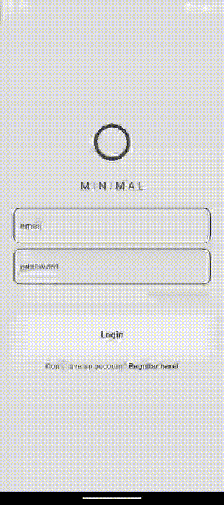

# MINIMAL Social



MINIMAL Social is a minimalist social networking app developed using Flutter. The app allows users
to post messages on their wall, fostering simple and direct communication. The project leverages the
power of Firebase for authentication and Firestore for cloud-based data storage. Additionally, the
app utilizes the `go_router` package for efficient and flexible routing within the application.

## Features

- **Minimalistic Design:** MINIMAL Social focuses on simplicity and a clean user interface to
  streamline the social networking experience.

- **Post Messages:** Users can easily post messages on their wall, keeping communication
  straightforward and direct.

- **Firebase Integration:** The app integrates Firebase services such as `cloud_firestore`
  and `firebase_auth` for efficient data storage and user authentication.

- **Efficient Routing:** The project uses the `go_router` package to manage navigation within the
  app, ensuring a smooth user experience.

## Getting Started

To run the app locally, follow these steps:

1. Clone the repository:

    ```bash
    git clone https://github.com/Cortrano/minimal_social.git
    ```

2. Navigate to the project directory:

    ```bash
    cd minimal_social
    ```

3. Install dependencies:

    ```bash
    flutter pub get
    ```

4. Configure Firebase:
    - Add Firebase to your Flutter app by
      following [Firebase Documentation](https://firebase.google.com/docs/flutter/setup)

5. Run the app:

    ```bash
    flutter run
    ```